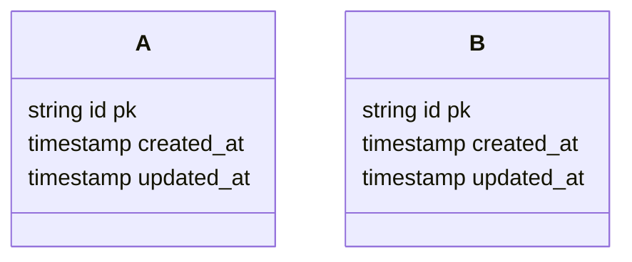

## Value Proposition

> [!NOTE]
> The main question is: What can users get out of using this feature from what they are paying for?

> [!TIP]
> Often related to lowering negative emotion, stress level, perceived difficulty etc.

---

## User Journey

> [!NOTE]
> This is a high level overview of the user journey.

## Requirements

### Functional Requirements

### Non-Functional Requirements

---

## Technical Stack

> [!NOTE]
> All about how computer and this software combined together in helping users to obtain those value proposed.


---

### Frontend

> [!NOTE]
> Organised by features


---

### Backend

> [!NOTE]
> Organised by domain, modularised

### Database

#### Database Schema



### Third Party Services

### DevOps

#### Infrastructure

#### CI/CD Pipeline

#### Monitoring

#### Security

#### Secrets Management

#### Testing

#### Documentation

---

### AI

#### Model / Provider

#### System prompt structure

#### Context Engineering

```

```

## References


## Logs

1. 