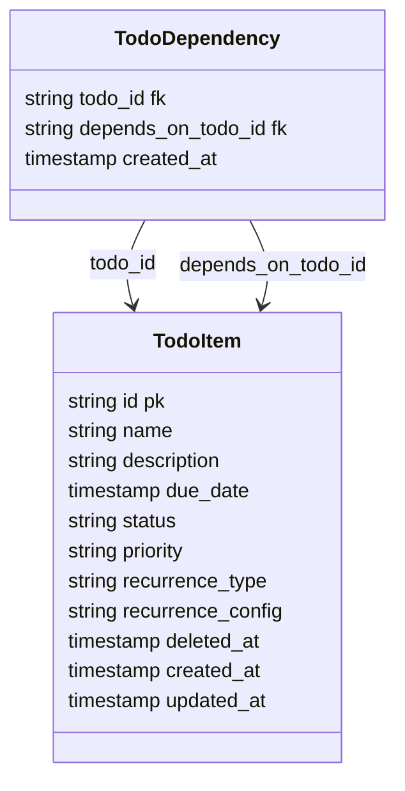

## Value Proposition

Users can track work in one place with predictable task states, clear priority ordering, and reliable due-date visibility. This reduces mental load during planning and execution by making the next action obvious, including when tasks are blocked or recurring.

---

## User Journey

1. User creates a TODO with name, description, due date, status, and priority.
2. User links dependencies when a task must wait for prerequisite tasks.
3. User filters and sorts the list to focus on urgent or blocked work.
4. User starts tasks; blocked tasks are prevented from moving to `In Progress` until all dependencies are completed.
5. User completes tasks; recurring tasks automatically generate the next occurrence.
6. User deletes tasks when needed; items are retained through soft-delete for recovery/audit needs.

## Requirements

### Functional Requirements

1. The system must support TODO CRUD operations.
2. Each TODO must contain: `id`, `name`, `description`, `due_date`, `status`, `priority`.
3. Status values must support: `Not Started`, `In Progress`, `Completed`, `Archived`.
4. Priority values must support: `Low`, `Medium`, `High`.
5. The system must support recurring schedules: `daily`, `weekly`, `monthly`, `custom`.
6. When a recurring TODO is marked `Completed`, the system must create the next occurrence automatically.
7. A TODO may depend on one or more TODOs.
8. A TODO with unmet dependencies must not transition to `In Progress`.
9. The list must support filtering by `status`, `priority`, `due_date`, and `dependency_state` (`blocked`, `unblocked`).
10. The list must support sorting by `due_date`, `priority`, `status`, and `name`.
11. The web UI must allow users to create, edit, delete, filter, and sort TODOs.
12. The backend API must expose endpoints needed by the web UI for all requirements above.

### Non-Functional Requirements

1. The API must support concurrent multi-user updates without losing data consistency.
2. Delete operations must be soft-delete based; deleted TODOs are excluded from default list queries.
3. List operations must remain responsive with 10,000+ TODO items.
4. Backend must enforce validation and return safe error responses for invalid requests.
5. Core behavior (CRUD, dependency blocking, recurrence generation, filtering/sorting) must be covered by tests.
6. The project must be runnable locally for development and verification.
7. API and setup documentation must be maintained.

---

## Technical Stack

### Frontend

- React-based todo list UI.
- Feature-level views/components for:
  - Todo creation and edit form.
  - Todo table/list with filter and sort controls.
  - Dependency and recurrence indicators.
- Client-side state tracks current filter/sort parameters and current page of results.

## Considerations

1. Filtering
   1. Filtering by due date should be a range filter.
   2. Filter by status, priority, dependency state should be a multi-select filter.
   3. Search by name or description would take more than just string, pattern matching.
      1. User may not know the exact name or description of the task, so we need to use a more flexible search.
      2. Full text search will be required here
      3. PSQL tsvector + tsquery will be used in this demo app

### UI Component Decomposition

#### 1) Domain and Query Contracts

- `Todo`: `id`, `name`, `description`, `due_date`, `status`, `priority`, `recurrence_type`, `recurrence_config`, `dependencies`.
- `TodoStatus`: `Not Started`, `In Progress`, `Completed`, `Archived`.
- `TodoPriority`: `Low`, `Medium`, `High`.
- `RecurrenceType`: `daily`, `weekly`, `monthly`, `custom`.
- `DependencyState`: `blocked`, `unblocked`.
- `TodoFilters`: `status`, `priority`, `due_date`, `dependency_state`.
- `TodoSort`: `field` (`due_date`, `priority`, `status`, `name`) + `direction` (`asc`, `desc`).
- `PaginationState`: `page`, `page_size`.

#### 2) Feature Shell and State Ownership

- `TodoFeaturePage` (composition root):
  - composes form, filter/sort bar, list/table, and badges/indicators.
- `useTodoFeatureState` (or `TodoStateProvider`):
  - owns current filters, sort, pagination, selected todo, and modal/form mode.
  - owns async query states (`idle`, `loading`, `success`, `error`).
- Child components should be presentational and receive data/callbacks via props.

#### 3) Create/Edit Form Components

- `TodoForm` (container and submit orchestration).
- `TodoNameField`
- `TodoDescriptionField`
- `TodoDueDateField`
- `TodoStatusField`
- `TodoPriorityField`
- `TodoRecurrenceField`
- `TodoCustomRecurrenceField` (only visible when recurrence is `custom`)
- `TodoDependenciesField` (multi-select dependency picker)
- `TodoFormActions` (submit + cancel)

#### 4) List/Table Components

- `TodoListSection` (list region container).
- `TodoTable` (table renderer).
- `TodoTableHeader` (sortable columns).
- `TodoRow` (single todo rendering).
- `TodoRowActions` (`edit`, `delete`, `complete`).
- `TodoPagination` (page navigation controls).

#### 5) Filter and Sort Components

- `TodoFilterBar` (control container).
- `StatusFilter`
- `PriorityFilter`
- `DueDateFilter`
- `DependencyStateFilter`
- `TodoSortControl` (sort field and direction)
- `ClearFiltersButton`

#### 6) Dependency and Recurrence Indicators

- `DependencyBadge` (`blocked` / `unblocked` state chip).
- `DependencyTooltip` (which dependencies are unmet).
- `RecurrenceBadge` (`daily`/`weekly`/`monthly`/`custom` tag).
- `NextOccurrencePreview` (next generated due date after completion).

#### 7) Rule Helper Units (Pure Logic)

- `isBlocked(todo, dependencyMap)`: true if any dependency is not completed.
- `canTransitionToInProgress(todo, dependencyMap)`: enforces "no unmet deps before `In Progress`".
- `getNextOccurrence(todo)`: computes next instance date for recurring todos.
- `buildFilterParams(filters)`: maps UI state to API query params.
- `buildSortParams(sort)`: maps UI sort state to API query params.

#### 8) API and Async UI State Units

- `TodoApiClient`:
  - `listTodos(filters, sort, pagination)`
  - `createTodo(payload)`
  - `updateTodo(id, payload)`
  - `deleteTodo(id)`
- `TodoMapper`: API DTO to UI contract mapping.
- Async state components:
  - `TodoLoadingState`
  - `TodoEmptyState`
  - `TodoErrorState`
- Form validation units:
  - `TodoFormValidationSummary`
  - `InlineFieldError`

#### Build Order

1. Domain/query contracts and API client contracts.
2. Feature shell and feature state ownership.
3. List/table and filter/sort controls.
4. Create/edit form split into small fields.
5. Dependency/recurrence indicators and rule helpers.
6. Async and validation UI states.


---

### Backend

- React Router SSR TypeScript API routes exposing handlers for CRUD, filter/sort query, dependency updates, and recurrence execution.
- Dependency and recurrence rules are enforced in backend logic (not UI-only checks).
- DTO responses expose only fields required by the todo-list client.

### Consideration

1. Multiple users may be using the same TODO list at the same time.
   1. We need to ensure that the data is consistent across all users writing to the same TODO item.
   2. PSQL offers ACID transactions and row level locking.
      1. Always use transactions when updating the TODO item.
      2. Use `select for update` to lock the row for the duration of the transaction.
      3. Client should always include a timestamp in the request. This is used to check against the `updated_at` timestamp to ensure the incoming request is not stale.
      4. If the incoming request is stale, the transaction should be rolled back and the client should be notified.
      5. If the incoming request is not stale, the transaction should be committed.
      6. If the transaction is committed, all clients should be notified.

## Backend API Specification

### Endpoints

| # | Method | Endpoint | Purpose |
|---|--------|----------|---------|
| 1 | GET | `/api/v1/todos` | List TODOs with filtering, sorting, and pagination |
| 2 | GET | `/api/v1/todos/:id` | Get single TODO by ID |
| 3 | POST | `/api/v1/todos` | Create new TODO |
| 4 | PUT | `/api/v1/todos/:id` | Update TODO with optimistic locking |
| 5 | DELETE | `/api/v1/todos/:id` | Soft delete TODO |

### Query Parameters

#### List Endpoint (GET /api/v1/todos)
- **Filters**: `status` (multi-select), `priority` (multi-select), `due_date_from`, `due_date_to`, `dependency_state` (blocked/unblocked)
- **Sort**: `sort_by` (due_date, priority, status, name), `sort_direction` (asc, desc)
- **Pagination**: `page`, `page_size`

#### Create Payload
```json
{
  "name": "string",
  "description": "string",
  "due_date": "timestamp",
  "status": "Not Started | In Progress | Completed | Archived",
  "priority": "Low | Medium | High",
  "recurrence_type": "daily | weekly | monthly | custom | null",
  "recurrence_config": "string (JSON for custom)",
  "dependencies": ["todo_id_1", "todo_id_2"]
}
```

#### Update Payload (PUT /api/v1/todos/:id)
```json
{
  "name": "string",
  "description": "string",
  "due_date": "timestamp",
  "status": "Not Started | In Progress | Completed | Archived",
  "priority": "Low | Medium | High",
  "recurrence_type": "daily | weekly | monthly | custom | null",
  "recurrence_config": "string (JSON for custom)",
  "dependencies": ["todo_id_1", "todo_id_2"],
  "updated_at": "timestamp (required for optimistic locking)"
}
```

### Implementation Notes

1. DTOs expose only fields required by client
2. Optimistic locking: client includes `updated_at` in update requests
3. Use `SELECT FOR UPDATE` with transactions for concurrent updates
4. Soft delete: set `deleted_at` timestamp, exclude from default queries
5. Shared create/edit form behavior: create requests use `POST /api/v1/todos`, and all edits to existing TODO items use `PUT /api/v1/todos/:id`

### Database

#### Database Schema



### Third Party Services

- Not required for this feature scope.

### DevOps

#### Infrastructure

- Not in scope for this feature document.

#### CI/CD Pipeline

- Reuse project CI pipeline; include todo feature test execution.

#### Monitoring

- Basic API error and latency monitoring for todo endpoints.

#### Security

- Input validation and safe error responses on todo APIs.

#### Secrets Management

- Reuse project-level secret management; no feature-specific secret required.

#### Testing

- Unit and/or integration tests for CRUD, dependency blocking, recurrence generation, and filter/sort behavior.

#### Documentation

- Maintain TODO API reference and local run steps in repository documentation.

---

### AI

#### Model / Provider

- Not required for this feature scope.

#### System prompt structure

- Not required for this feature scope.

#### Context Engineering

- Not required for this feature scope.

## References

- `docs/features/template.md`
- `docs/main.md`

## Logs

1. Drafted todo-list feature document from template with todo-only scope from `docs/main.md`.
