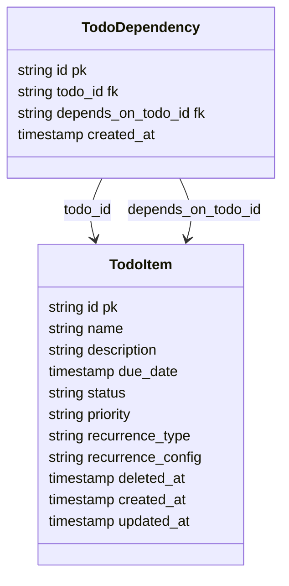

## Value Proposition

Users can track work in one place with predictable task states, clear priority ordering, and reliable due-date visibility. This reduces mental load during planning and execution by making the next action obvious, including when tasks are blocked or recurring.

---

## User Journey

1. User creates a TODO with name, description, due date, status, and priority.
2. User links dependencies when a task must wait for prerequisite tasks.
3. User filters and sorts the list to focus on urgent or blocked work.
4. User starts tasks; blocked tasks are prevented from moving to `In Progress` until all dependencies are completed.
5. User completes tasks; recurring tasks automatically generate the next occurrence.
6. User deletes tasks when needed; items are retained through soft-delete for recovery/audit needs.

## Requirements

### Functional Requirements

1. The system must support TODO CRUD operations.
2. Each TODO must contain: `id`, `name`, `description`, `due_date`, `status`, `priority`.
3. Status values must support: `Not Started`, `In Progress`, `Completed`, `Archived`.
4. Priority values must support: `Low`, `Medium`, `High`.
5. The system must support recurring schedules: `daily`, `weekly`, `monthly`, `custom`.
6. When a recurring TODO is marked `Completed`, the system must create the next occurrence automatically.
7. A TODO may depend on one or more TODOs.
8. A TODO with unmet dependencies must not transition to `In Progress`.
9. The list must support filtering by `status`, `priority`, `due_date`, and `dependency_state` (`blocked`, `unblocked`).
10. The list must support sorting by `due_date`, `priority`, `status`, and `name`.
11. The web UI must allow users to create, edit, delete, filter, and sort TODOs.
12. The backend API must expose endpoints needed by the web UI for all requirements above.

### Non-Functional Requirements

1. The API must support concurrent multi-user updates without losing data consistency.
2. Delete operations must be soft-delete based; deleted TODOs are excluded from default list queries.
3. List operations must remain responsive with 10,000+ TODO items.
4. Backend must enforce validation and return safe error responses for invalid requests.
5. Core behavior (CRUD, dependency blocking, recurrence generation, filtering/sorting) must be covered by tests.
6. The project must be runnable locally for development and verification.
7. API and setup documentation must be maintained.

---

## Technical Stack

### Frontend

- React-based todo list UI.
- Feature-level views/components for:
  - Todo creation and edit form.
  - Todo table/list with filter and sort controls.
  - Dependency and recurrence indicators.
- Client-side state tracks current filter/sort parameters and current page of results.

---

### Backend

- Golang todo domain module exposing API handlers for CRUD, filter/sort query, dependency updates, and recurrence execution.
- Dependency and recurrence rules are enforced in backend logic (not UI-only checks).
- DTO responses expose only fields required by the todo-list client.

### Database

#### Database Schema

### Third Party Services

- Not required for this feature scope.

### DevOps

#### Infrastructure

- Not in scope for this feature document.

#### CI/CD Pipeline

- Reuse project CI pipeline; include todo feature test execution.

#### Monitoring

- Basic API error and latency monitoring for todo endpoints.

#### Security

- Input validation and safe error responses on todo APIs.

#### Secrets Management

- Reuse project-level secret management; no feature-specific secret required.

#### Testing

- Unit and/or integration tests for CRUD, dependency blocking, recurrence generation, and filter/sort behavior.

#### Documentation

- Maintain TODO API reference and local run steps in repository documentation.

---

### AI

#### Model / Provider

- Not required for this feature scope.

#### System prompt structure

- Not required for this feature scope.

#### Context Engineering

- Not required for this feature scope.

## References

- `docs/features/template.md`
- `docs/main.md`

## Logs

1. Drafted todo-list feature document from template with todo-only scope from `docs/main.md`.
