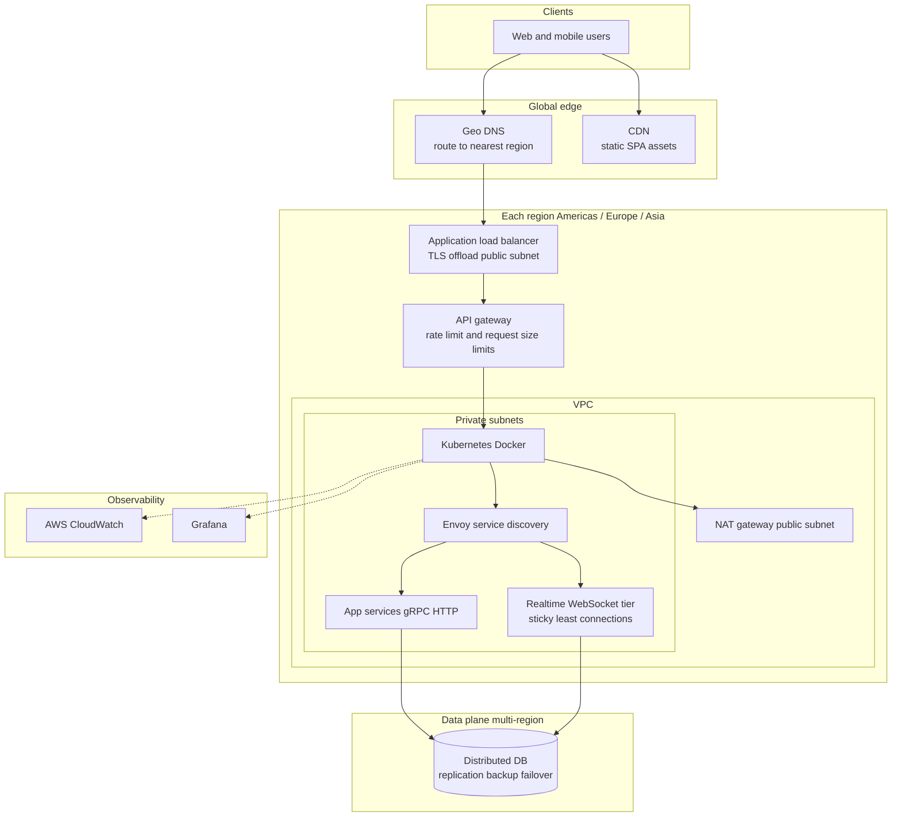
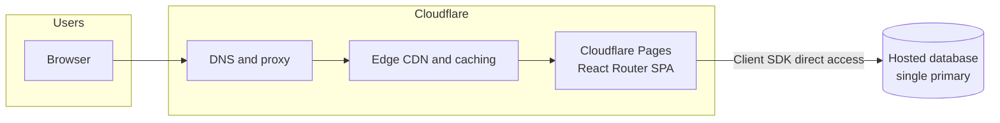

# Infrastructure

This document summarizes deployment shapes described in [main.md](./main.md): **AWS** for a real-world, multi-region production footprint, and **Cloudflare** for a lightweight demo.

## Infrastructure on AWS (real production deployment)

Production targets **global availability**, **multi-tenant** isolation at large scale, and **regional data placement** (for example GDPR: keep user data in the region where the user is located).

- **Traffic and regions** — **Geo DNS** sends users to the nearest of three continental footprints: **Americas**, **Europe**, and **Asia**. A **CDN** delivers static SPA assets.
- **Per-region entry** — An **application load balancer** terminates **TLS**. Use **round robin** for unary **gRPC** calls; use **least connections** and **sticky sessions** for **WebSocket** / real-time collaboration. An **API gateway** in each region enforces **rate limiting** and **request size limits**.
- **Application platform** — **Kubernetes** runs **Docker** images. **Envoy** handles **service discovery**; service-to-service traffic stays on the cluster network.
- **Data** — Databases follow a global plan for **replication**, **backup**, and **failover**. Candidate stores include **Cassandra**, **CockroachDB**, and **ScyllaDB**.
- **Security and network layout** — Databases and secrets are **encrypted at rest**. Only **NAT gateways** and **load balancers** live in **public subnets**; workloads run in **private subnets** and reach the internet via NAT.
- **Observability** — **AWS CloudWatch** and **Grafana** support monitoring and logging.

## Infrastructure on demo app

The **demo app** favors **Cloudflare** over full multi-region **AWS** so you can ship quickly with less operations work.

- **Edge** — **DNS** and **CDN** sit in front of the app.
- **Frontend** — **Cloudflare Pages** hosts the **React** app with **React Router** (SPA routing, no separate SSR tier required for this sketch).
- **Data** — A **single** (or lightly replicated) **hosted database** is enough to try TODO flows. The diagram assumes the SPA talks to the database **directly from the client** (for example via a **BaaS / hosted DB SDK**), so there is **no dedicated Go (or other) API service** in this demo path.
- **Scope** — This intentionally skips **Kubernetes**, **multi-region replication**, and the full production **security / compliance** program; those stay **out of scope** for the take-home boundary in [main.md](./main.md).

